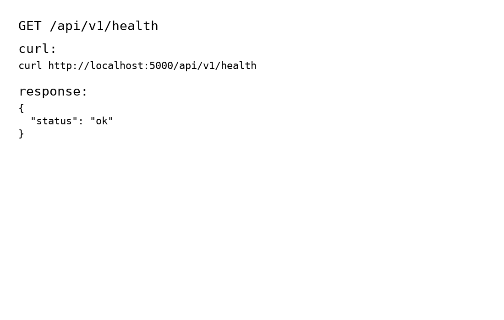
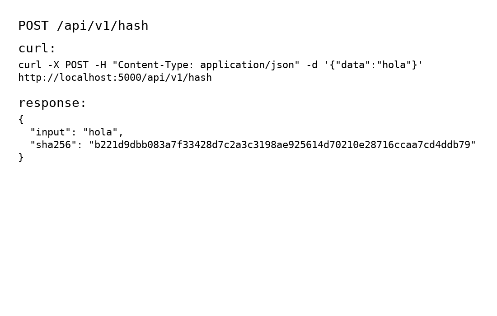
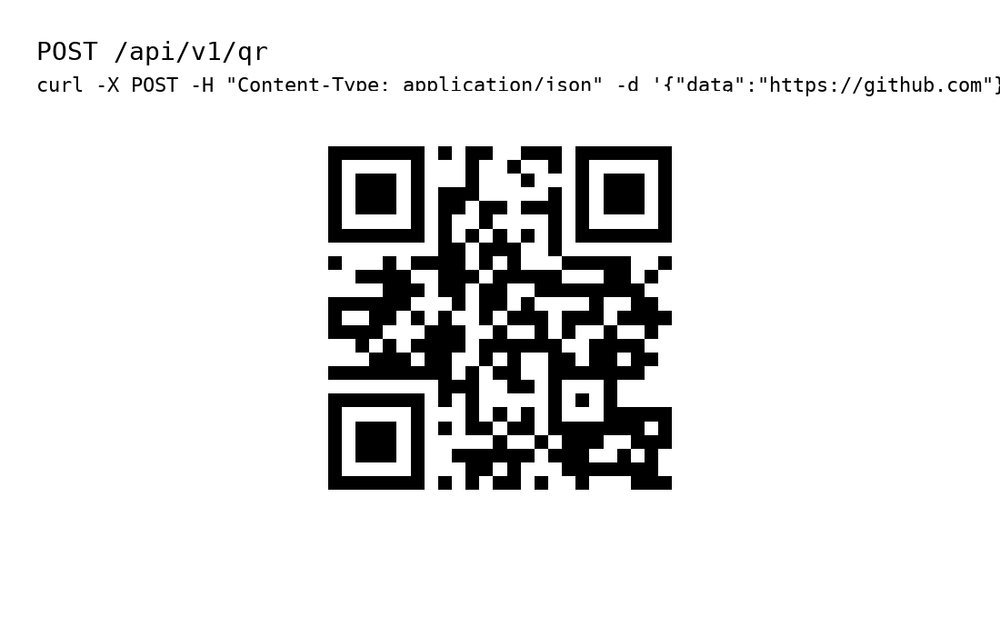

# CyberSec Toolkit API 🔐

API de utilidades básicas de ciberseguridad desarrollada en **Flask** y desplegada con **Docker**.

## 🚀 Endpoints principales
- `GET /api/v1/health` → Estado del servicio
- `POST /api/v1/hash` → Hash SHA256
- `POST /api/v1/entropy` → Entropía Shannon
- `POST /api/v1/password/strength` → Verificar fortaleza de contraseñas
- `POST /api/v1/qr` → Generar QR
- `POST /api/v1/base64` *(feature branch)* → Codificar en Base64

## 🐳 Docker
```bash
docker build -t cybersec-api .
docker run -d -p 5000:5000 cybersec-api
```

## 📸 Ejemplos de uso

### Healthcheck
```bash
curl http://localhost:5000/api/v1/health
```


### Hash
```bash
curl -X POST -H "Content-Type: application/json" -d '{"data":"hola"}' http://localhost:5000/api/v1/hash
```


### QR
```bash
curl -X POST -H "Content-Type: application/json" -d '{"data":"https://github.com"}' http://localhost:5000/api/v1/qr --output qr.png
```

